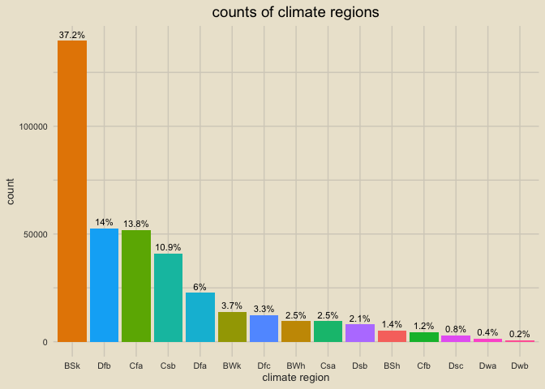
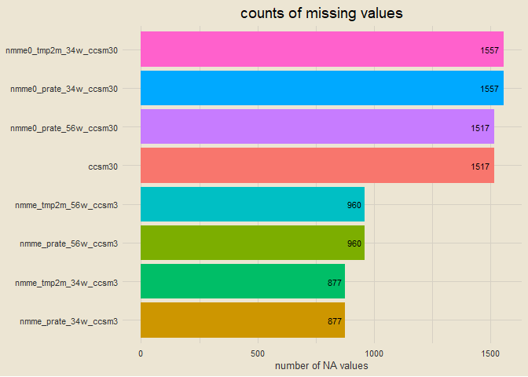
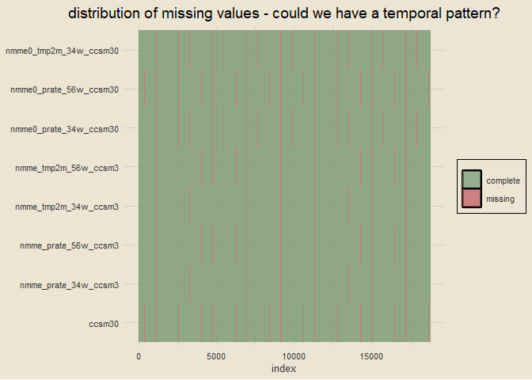

wids datathon 2023
================
chad allison
2023-01-31

------------------------------------------------------------------------

### setup

``` r
library(tidyverse)
library(tidymodels)
library(tvthemes)
library(janitor)
library(lubridate)
library(skimr)
options(scipen = 999)

adjust_theme = theme(panel.grid.major = element_line(linewidth = 0.5, colour = "#D6D0C4"),
                     panel.grid.minor = element_line(linewidth = 0.5, colour = "#D6D0C4"))
```

------------------------------------------------------------------------

### data import

``` r
train = read_csv("train_data.csv", col_types = cols()) |> clean_names()
test = read_csv("test_data.csv", col_types = cols()) |> clean_names()
sample_sol = read_csv("sample_solution.csv", col_types = cols()) |> clean_names()
paste0("training dimensions: ", nrow(train), " rows x ", ncol(train), " columns")
```

    ## [1] "training dimensions: 375734 rows x 246 columns"

``` r
paste0("testing dimensions: ", nrow(test), " rows x ", ncol(test), " columns")
```

    ## [1] "testing dimensions: 31354 rows x 245 columns"

------------------------------------------------------------------------

### finding variable types

``` r
paste0(ncol(select(train, where(is.numeric))), " numeric variables; ",
       ncol(select(train, where(is.character))), " character variables")
```

    ## [1] "244 numeric variables; 2 character variables"

------------------------------------------------------------------------

### reformatting `startdate` and `climateregions_climateregion` variables

``` r
train = train |>
  mutate(startdate = parse_date(startdate, format = "%m/%d/%y"),
         year = year(startdate),
         month = month(startdate),
         day = day(startdate),
         climateregions_climateregion = as.factor(climateregions_climateregion)) |>
  rename(climate_region = climateregions_climateregion)

train |>
  select(startdate, year, month, day, climate_region) |>
  skim()
```

|                                                  |                            |
|:-------------------------------------------------|:---------------------------|
| Name                                             | select(train, startdate, … |
| Number of rows                                   | 375734                     |
| Number of columns                                | 5                          |
| \_\_\_\_\_\_\_\_\_\_\_\_\_\_\_\_\_\_\_\_\_\_\_   |                            |
| Column type frequency:                           |                            |
| Date                                             | 1                          |
| factor                                           | 1                          |
| numeric                                          | 3                          |
| \_\_\_\_\_\_\_\_\_\_\_\_\_\_\_\_\_\_\_\_\_\_\_\_ |                            |
| Group variables                                  | None                       |

Data summary

**Variable type: Date**

| skim_variable | n_missing | complete_rate | min        | max        | median     | n_unique |
|:--------------|----------:|--------------:|:-----------|:-----------|:-----------|---------:|
| startdate     |         0 |             1 | 2014-09-01 | 2016-08-31 | 2015-09-01 |      731 |

**Variable type: factor**

| skim_variable  | n_missing | complete_rate | ordered | n_unique | top_counts                                      |
|:---------------|----------:|--------------:|:--------|---------:|:------------------------------------------------|
| climate_region |         0 |             1 | FALSE   |       15 | BSk: 139621, Dfb: 52632, Cfa: 51901, Csb: 40936 |

**Variable type: numeric**

| skim_variable | n_missing | complete_rate |    mean |   sd |   p0 |  p25 |  p50 |  p75 | p100 | hist  |
|:--------------|----------:|--------------:|--------:|-----:|-----:|-----:|-----:|-----:|-----:|:------|
| year          |         0 |             1 | 2015.17 | 0.69 | 2014 | 2015 | 2015 | 2016 | 2016 | ▃▁▇▁▆ |
| month         |         0 |             1 |    6.52 | 3.45 |    1 |    4 |    7 |   10 |   12 | ▇▅▅▅▇ |
| day           |         0 |             1 |   15.74 | 8.80 |    1 |    8 |   16 |   23 |   31 | ▇▇▇▇▆ |

------------------------------------------------------------------------

### counting climate regions

``` r
train |>
  count(climate_region) |>
  ggplot(aes(reorder(climate_region, -n), n)) +
  geom_col(aes(fill = climate_region)) +
  geom_text(aes(label = n), size = 3, vjust = -0.5) +
  theme_avatar() +
  labs(x = "climate region", y = "count", title = "counts of climate regions") +
  theme(plot.title = element_text(hjust = 0.5),
        legend.position = "none") +
  adjust_theme
```

<!-- -->

------------------------------------------------------------------------

### outcome variable distribution

``` r
train |>
  ggplot(aes(contest_tmp2m_14d_tmp2m)) +
  geom_histogram(bins = 25, col = "black", fill = "#81A384") +
  theme_avatar() +
  labs(x = "outcome variable: contest_tmp2m_14d_tmp2m",
       y = "count", title = "distribution of outcome variable") +
  theme(plot.title = element_text(hjust = 0.5),
        panel.grid.major = element_line(linewidth = 0.5, colour = "#CFC7B7"),
        panel.grid.minor = element_line(linewidth = 0.5, colour = "#CFC7B7"))
```

<!-- -->

------------------------------------------------------------------------

### boxplots

``` r
train |>
  ggplot(aes(reorder(climate_region, contest_tmp2m_14d_tmp2m), contest_tmp2m_14d_tmp2m)) +
  geom_boxplot(aes(fill = climate_region)) +
  coord_flip() +
  theme_avatar() +
  labs(x = "climate region", y = "outcome variable: contest_tmp2m_14d_tmp2m",
       title = "boxplots of outcome variable by region") +
  theme(plot.title = element_text(hjust = 0.5),
        legend.position = "none",
        panel.grid.major = element_line(linewidth = 0.5, colour = "#CFC7B7"),
        panel.grid.minor = element_line(linewidth = 0.5, colour = "#CFC7B7"))
```

<!-- -->

------------------------------------------------------------------------
