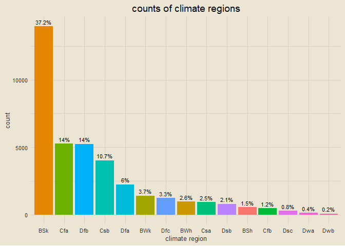
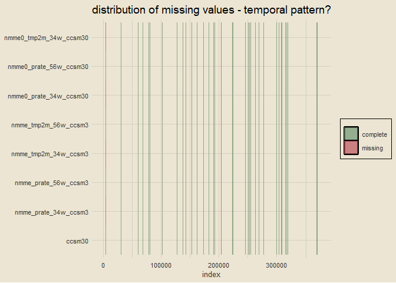
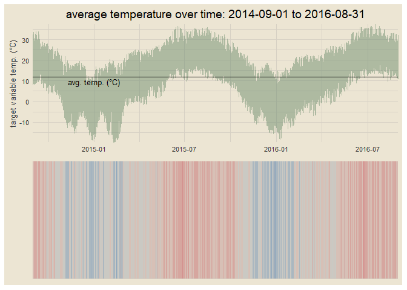
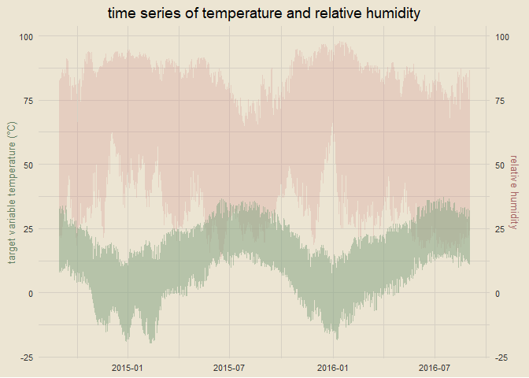
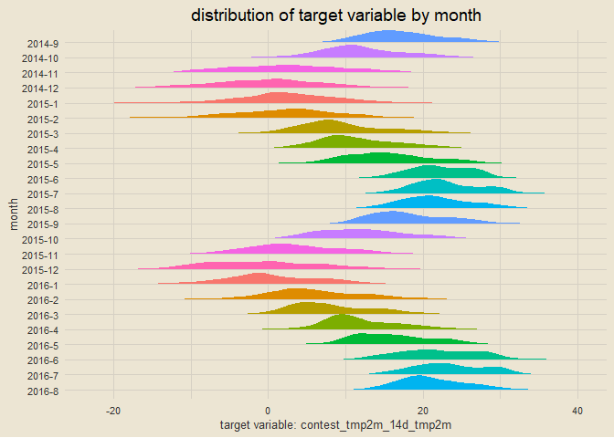
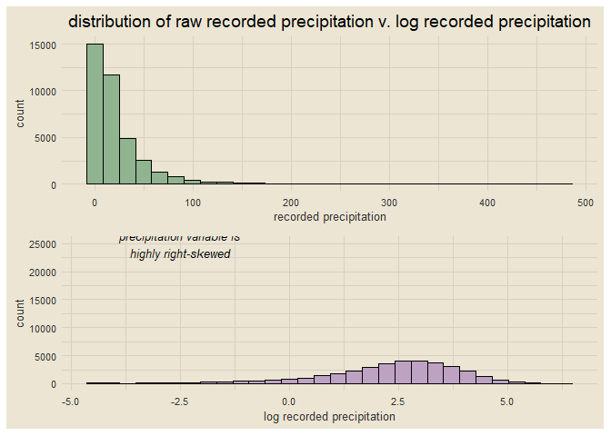
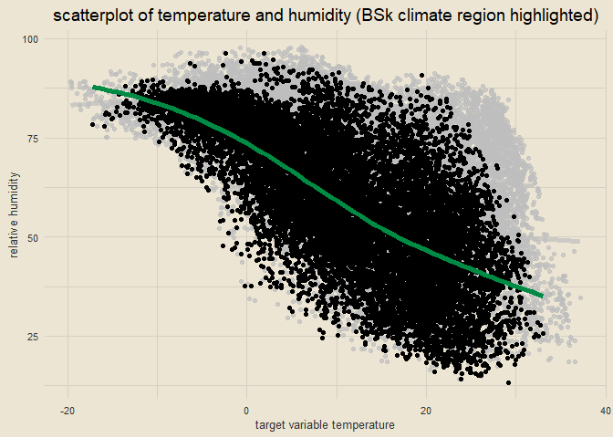
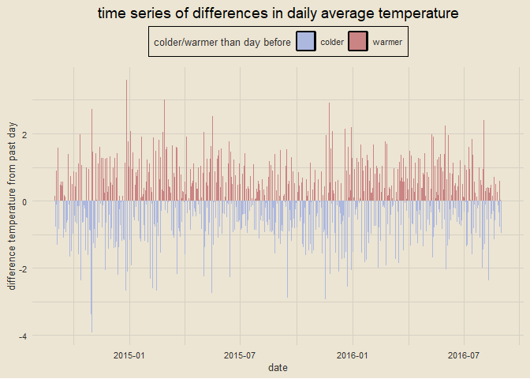
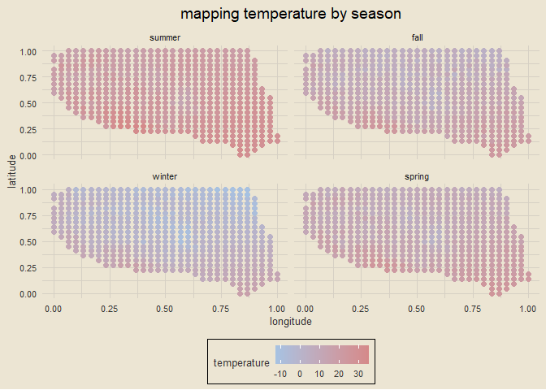

wids datathon 2023
================
chad allison
2023-01-31

------------------------------------------------------------------------

[kaggle
link](https://www.kaggle.com/competitions/widsdatathon2023/overview)

------------------------------------------------------------------------

### setup

``` r
tictoc::tic()
library(tidyverse)
library(tidymodels)
library(tvthemes)
library(janitor)
library(lubridate)
library(skimr)
library(patchwork)
library(ggridges)
options(scipen = 999)

theme_custom = theme_avatar() +
  theme(plot.title = element_text(hjust = 0.5),
        panel.grid.major = element_line(linewidth = 0.5, colour = "#D6D0C4"),
        panel.grid.minor = element_line(linewidth = 0.5, colour = "#D6D0C4"))
```

------------------------------------------------------------------------

### data import

``` r
train = read_csv("train_data.csv", col_types = cols()) |> clean_names()
test = read_csv("test_data.csv", col_types = cols()) |> clean_names()
sample_sol = read_csv("sample_solution.csv", col_types = cols()) |> clean_names()
paste0("training dimensions: ", nrow(train), " rows x ", ncol(train), " columns")
```

    ## [1] "training dimensions: 375734 rows x 246 columns"

``` r
paste0("testing dimensions: ", nrow(test), " rows x ", ncol(test), " columns")
```

    ## [1] "testing dimensions: 31354 rows x 245 columns"

------------------------------------------------------------------------

### finding variable types

``` r
paste0(ncol(select(train, where(is.numeric))), " numeric variables; ",
       ncol(select(train, where(is.character))), " character variables")
```

    ## [1] "244 numeric variables; 2 character variables"

------------------------------------------------------------------------

### reformatting `startdate` and `climateregions_climateregion` variables

``` r
train = train |>
  mutate(startdate = parse_date(startdate, format = "%m/%d/%y"),
         year = year(startdate),
         month = month(startdate),
         day = day(startdate),
         climateregions_climateregion = as.factor(climateregions_climateregion)) |>
  rename(climate_region = climateregions_climateregion)

train |>
  select(startdate, year, month, day, climate_region) |>
  skim()
```

|                                                  |                            |
|:-------------------------------------------------|:---------------------------|
| Name                                             | select(train, startdate, … |
| Number of rows                                   | 375734                     |
| Number of columns                                | 5                          |
| \_\_\_\_\_\_\_\_\_\_\_\_\_\_\_\_\_\_\_\_\_\_\_   |                            |
| Column type frequency:                           |                            |
| Date                                             | 1                          |
| factor                                           | 1                          |
| numeric                                          | 3                          |
| \_\_\_\_\_\_\_\_\_\_\_\_\_\_\_\_\_\_\_\_\_\_\_\_ |                            |
| Group variables                                  | None                       |

Data summary

**Variable type: Date**

| skim_variable | n_missing | complete_rate | min        | max        | median     | n_unique |
|:--------------|----------:|--------------:|:-----------|:-----------|:-----------|---------:|
| startdate     |         0 |             1 | 2014-09-01 | 2016-08-31 | 2015-09-01 |      731 |

**Variable type: factor**

| skim_variable  | n_missing | complete_rate | ordered | n_unique | top_counts                                      |
|:---------------|----------:|--------------:|:--------|---------:|:------------------------------------------------|
| climate_region |         0 |             1 | FALSE   |       15 | BSk: 139621, Dfb: 52632, Cfa: 51901, Csb: 40936 |

**Variable type: numeric**

| skim_variable | n_missing | complete_rate |    mean |   sd |   p0 |  p25 |  p50 |  p75 | p100 | hist  |
|:--------------|----------:|--------------:|--------:|-----:|-----:|-----:|-----:|-----:|-----:|:------|
| year          |         0 |             1 | 2015.17 | 0.69 | 2014 | 2015 | 2015 | 2016 | 2016 | ▃▁▇▁▆ |
| month         |         0 |             1 |    6.52 | 3.45 |    1 |    4 |    7 |   10 |   12 | ▇▅▅▅▇ |
| day           |         0 |             1 |   15.74 | 8.80 |    1 |    8 |   16 |   23 |   31 | ▇▇▇▇▆ |

------------------------------------------------------------------------

### counting climate regions

``` r
train |>
  count(climate_region) |>
  mutate(pct = paste0(round(n / sum(n) * 100, 1), "%")) |>
  ggplot(aes(reorder(climate_region, -n), n)) +
  geom_col(aes(fill = climate_region)) +
  geom_text(aes(label = pct), size = 3, vjust = -0.5) +
  theme_avatar() +
  labs(x = "climate region", y = "count", title = "counts of climate regions") +
  theme_custom +
  theme(legend.position = "none")
```

<!-- -->

------------------------------------------------------------------------

### finding missing values

``` r
data.frame(x = names(train), y = colSums(is.na(train))) |>
  filter(y > 0) |>
  ggplot(aes(reorder(x, y), y)) +
  geom_col(aes(fill = x)) +
  geom_text(aes(label = y), hjust = 1.25, size = 3) +
  labs(x = NULL, y = "number of NA values",
       title = "counts of missing values") +
  coord_flip() +
  theme_custom +
  theme(legend.position = "none")
```

<!-- -->

------------------------------------------------------------------------

### distribution of all missing values MAKE SURE TO REMOVE HEAD LINE

``` r
vars_with_NAs = data.frame(col = names(train), n = colSums(is.na(train))) |>
  filter(n > 0) |>
  pull(col)

train |>
  select(index, all_of(vars_with_NAs)) |>
  head(nrow(train) * 0.05) |> # REMOVE THIS LINE
  pivot_longer(cols = -index, names_to = "var_name", values_to = "value") |>
  mutate(is_na = is.na(value)) |>
  ggplot(aes(var_name, index)) +
  geom_tile(aes(fill = is_na), alpha = 0.75) +
  scale_fill_manual(values = c("#71926B", "#BA5757"), labels = c("complete", "missing")) +
  coord_flip() +
  theme_custom +
  labs(x = NULL, y = "index", fill = NULL,
       title = "distribution of missing values - temporal pattern?") +
  theme(plot.title = element_text(hjust = 0.5),
        legend.position = "right")
```

<!-- -->

------------------------------------------------------------------------

### checking distributions of missing variables before imputation

``` r
train |>
  select(all_of(vars_with_NAs)) |>
  pivot_longer(everything()) |>
  na.omit() |>
  ggplot(aes(value)) +
  geom_density(aes(fill = name), alpha = 0.4) +
  annotate("text", x = 95, y = 0.025, fontface = "italic", size = 3.5,
           label = "none of the variables look extremely\nskewed; we can impute with mean") +
  theme_custom +
  labs(title = "distributions of variables with missing values", fill = NULL) +
  theme(legend.position = "right")
```

<!-- -->

------------------------------------------------------------------------

### imputing missing data

``` r
train = train |>
  mutate(across(.cols = all_of(vars_with_NAs), ~ replace_na(., mean(., na.rm = T))))

paste0("number of NA values in training data: ", sum(is.na(train)))
```

    ## [1] "number of NA values in training data: 0"

------------------------------------------------------------------------

### visualization of target variable

``` r
fig1 = train |>
  ggplot(aes(startdate, contest_tmp2m_14d_tmp2m)) +
  geom_line(col = "#718F70", alpha = 0.5) +
  geom_hline(yintercept = mean(train$contest_tmp2m_14d_tmp2m), col = "black") +
  annotate("text", x = as_date("2015-01-01"), y = mean(train$contest_tmp2m_14d_tmp2m) - 2,
           label = "avg. temp. (\u00B0C)", size = 3.5) +
  labs(x = NULL, y = "target variable temp. (\u00B0C)",
       title = paste0("average temperature over time: ", min(train$startdate),
                      " to ", max(train$startdate))) +
  theme_custom +
  coord_cartesian(expand = F)

fig2 = train |>
  ggplot(aes(startdate, y = 1)) +
  geom_tile(aes(fill = contest_tmp2m_14d_tmp2m)) +
  scale_fill_stepsn(colors = c("#789DBB", "#D6D0C4", "#D38585")) +
  theme_custom +
  labs(x = NULL, y = NULL) +
  theme(legend.position = "none",
        axis.text = element_blank()) +
  coord_cartesian(expand = F)

fig1 / fig2
```

<!-- -->

------------------------------------------------------------------------

### finding average monthly temperatures

``` r
train |>
  mutate(month = month(month, label = T),
         year = factor(year)) |>
  group_by(year, month) |>
  summarise(mean_temp = mean(contest_tmp2m_14d_tmp2m),
            .groups = "drop") |>
  ggplot(aes(month, mean_temp)) +
  geom_line(aes(group = year, col = year), linewidth = 2, alpha = 0.5) +
  facet_wrap(vars(year), nrow = 3) +
  theme_custom +
  labs(x = "month", y = "average temperature (\u00B0C)",
       title = "average monthly temperature (\u00B0C) by year",
       subtitle = "note that 2015 is our only year of complete data") +
  theme(legend.position = "none",
        plot.subtitle = element_text(hjust = 0.5, vjust = 1.75, size = 9, face = "italic"))
```

<!-- -->

------------------------------------------------------------------------

### shapiro test for normality

``` r
shapiro_sample = train |>
  pull(contest_tmp2m_14d_tmp2m) |>
  sample(5000) |>
  shapiro.test()

shapiro_sample
```

    ## 
    ##  Shapiro-Wilk normality test
    ## 
    ## data:  sample(pull(train, contest_tmp2m_14d_tmp2m), 5000)
    ## W = 0.99082, p-value < 0.00000000000000022

because of the p-value less than 0.05, we cannot assume that the
population this data is sampled from is normally distributed.

------------------------------------------------------------------------

### viewing distribution of target variable

``` r
train |>
  ggplot(aes(contest_tmp2m_14d_tmp2m)) +
  geom_histogram(bins = 30, col = "black", fill = "#90B48F") +
  theme_custom +
  labs(x = "target variable: contest_tmp2m_14d_tmp2m",
       title = "histogram of target variable")
```

<!-- -->

------------------------------------------------------------------------

### distribution of target variable by year

``` r
train |>
  mutate(year = factor(year)) |>
  ggplot(aes(contest_tmp2m_14d_tmp2m)) +
  geom_histogram(aes(fill = year), bins = 30, col = "black") +
  scale_fill_manual(values = c("#96B3CD", "#90B48F", "#BEA2C3")) +
  theme_custom +
  labs(x = "target variable: contest_tmp2m_14d_tmp2m",
       title = "histogram of target variable by year") +
  facet_wrap(vars(year), nrow = 3) +
  theme(legend.position = "none")
```

<!-- -->

------------------------------------------------------------------------

### distribution of target variable by region

``` r
train |>
  mutate(year = factor(year)) |>
  ggplot(aes(contest_tmp2m_14d_tmp2m)) +
  geom_histogram(bins = 30, col = "black", fill = "#90B48F") +
  theme_custom +
  labs(x = "target variable: contest_tmp2m_14d_tmp2m",
       title = "histogram of target variable by year") +
  facet_wrap(vars(climate_region)) +
  theme(legend.position = "none")
```

<!-- -->

------------------------------------------------------------------------

### distribution of target variable by climate region

``` r
train |>
  ggplot(aes(contest_tmp2m_14d_tmp2m, reorder(climate_region, contest_tmp2m_14d_tmp2m))) +
  geom_density_ridges(aes(fill = climate_region), col = "transparent", scale = 1) +
  theme_custom +
  labs(x = "target variable: contest_tmp2m_14d_tmp2m", y = "climate region",
       title = "distribution of target variable in different climate regions") +
  theme(legend.position = "none")
```

<!-- -->

------------------------------------------------------------------------

### distribution of target variable in climate regions by season

``` r
train |>
  mutate(season = case_when(month %in% c(12, 1, 2) ~ "winter",
                            month %in% 3:5 ~ "spring",
                            month %in% 6:8 ~ "summer",
                            month %in% 9:11 ~ "fall")) |>
  ggplot(aes(contest_tmp2m_14d_tmp2m, reorder(climate_region, contest_tmp2m_14d_tmp2m))) +
  geom_density_ridges(aes(fill = climate_region), col = "transparent", scale = 1) +
  theme_custom +
  labs(x = "target variable: contest_tmp2m_14d_tmp2m", y = "climate region",
       title = "distribution of target variable in different climate regions by season") +
  theme(legend.position = "none") +
  facet_wrap(vars(season))
```

<!-- -->

------------------------------------------------------------------------

### visualizing variable correlations to target variable

``` r
fig_df = train |>
  sample_n(10000) |>
  select(where(is.numeric)) |>
  cor() |>
  data.frame() |>
  select(contest_tmp2m_14d_tmp2m)

fig_df |>
  mutate(var = rownames(fig_df)) |>
  ggplot(aes(reorder(var, contest_tmp2m_14d_tmp2m), contest_tmp2m_14d_tmp2m)) +
  geom_col(aes(fill = var)) +
  geom_hline(yintercept = -0.75, linetype = "dashed") +
  geom_hline(yintercept = 0.75, linetype = "dashed") +
  annotate("text", x = 10, y = 0.6, label = "threshold = 0.75", size = 3) +
  annotate("text", x = 240, y = -0.585, label = "threshold = -0.75", size = 3) +
  theme_custom +
  labs(x = "variable", y = "correlation with target variable",
       title = "variable correlations with target variable") +
  theme(legend.position = "none",
        axis.text.y = element_blank()) +
  coord_flip(ylim = c(-1, 1))
```

<!-- -->

------------------------------------------------------------------------

### time series visualization of target variable and relative humidity

``` r
train |>
  ggplot() +
  geom_line(aes(startdate, contest_rhum_sig995_14d_rhum), alpha = 0.25, col = "#D18989") +
  geom_line(aes(startdate, contest_tmp2m_14d_tmp2m), alpha = 0.5, col = "#80A280") +
  scale_y_continuous(name = "target variable temperature (\u00B0C)",
                     sec.axis = sec_axis(~ . * 1, name = "relative humidity")) +
  theme_custom +
  labs(x = NULL, title = "time series of temperature and relative humidity") +
  theme(axis.title.y.left = element_text(color = "#658062"),
        axis.title.y.right = element_text(color = "#A56565"))
```

<!-- -->

------------------------------------------------------------------------

### time series visualization of temperature and precipitation

``` r
train |>
  ggplot() +
  geom_line(aes(startdate, contest_precip_14d_precip / 10), alpha = 0.55, col = "#A5B7D4") +
  geom_line(aes(startdate, contest_tmp2m_14d_tmp2m), alpha = 0.5, col = "#80A280") +
  scale_y_continuous(name = "target variable temperature (\u00B0C)",
                     sec.axis = sec_axis(~ . * 1, name = "precipitation (divided by 10 for scale)")) +
  theme_custom +
  labs(x = NULL, title = "time series of temperature and precipitation") +
  theme(axis.title.y.left = element_text(color = "#658062"),
        axis.title.y.right = element_text(color = "#657794"))
```

<!-- -->

------------------------------------------------------------------------

### visualization of target variable by month

``` r
ordered_months = c("2014-9", "2014-10", "2014-11", "2014-12",
                   "2015-1", "2015-2", "2015-3", "2015-4", "2015-5", "2015-6",
                   "2015-7", "2015-8", "2015-9", "2015-10", "2015-11", "2015-12",
                   "2016-1", "2016-2", "2016-3", "2016-4",
                   "2016-5", "2016-6", "2016-7", "2016-8")

train |>
  slice_sample(prop = 0.1) |>
  mutate(month2 = paste0(year, "-", month),
         month2 = factor(month2, levels = rev(ordered_months))) |>
  ggplot(aes(contest_tmp2m_14d_tmp2m, month2)) +
  geom_density_ridges(aes(fill = factor(month)), col = "transparent", scale = 1) +
  theme_custom +
  labs(x = "target variable: contest_tmp2m_14d_tmp2m", y = "month",
       title = "distribution of target variable by month") +
  theme(legend.position = "none")
```

<!-- -->

------------------------------------------------------------------------

### visualizing relationship between precipitation and temperature

``` r
cor_val = round(cor(train$contest_precip_14d_precip, train$contest_tmp2m_14d_tmp2m), 3)

train |>
  slice_sample(prop = 0.1) |>
  ggplot(aes(contest_precip_14d_precip, contest_tmp2m_14d_tmp2m)) +
  geom_point(alpha = 0.25) +
  geom_smooth(formula = y ~ x, method = "lm", col = "springgreen4") +
  theme_custom +
  labs(x = "recorded precipitation", y = "recorded temperature",
       title = "scatterplot of recorded precipitation and temperature") +
  annotate("text", x = 250, y = -10, label = paste0("weak correlation;\ncoefficient = ", cor_val), size = 3.5, fontface = "italic")
```

<!-- -->

------------------------------------------------------------------------

### distribution of recorded precipitation

``` r
unlogged = train |>
  ggplot(aes(contest_precip_14d_precip)) +
  geom_histogram(bins = 30, fill = "#90B48F", col = "black") +
  theme_custom +
  labs(x = "recorded precipitation", y = "count",
       title = "distribution of raw recorded precipitation v. log recorded precipitation")

logged = train |>
  mutate(log_precip = log(contest_precip_14d_precip)) |>
  ggplot(aes(log_precip)) +
  geom_histogram(bins = 30, fill = "#BEA2C3", col = "black") +
  theme_custom +
  labs(x = "log recorded precipitation", y = "count") +
  annotate("text", x = -2.5, y = 25000, label = "precipitation variable is\nhighly right-skewed", fontface = "italic", size = 3.5)

unlogged / logged
```

<!-- -->

------------------------------------------------------------------------

### climate regions

we have fifteen climate regions in the data; [here is what each value
indicates](https://en.wikipedia.org/wiki/K%C3%B6ppen_climate_classification#:~:text=The%20K%C3%B6ppen%20climate%20classification%20scheme,indicates%20the%20level%20of%20heat.).

- BSh: hot semi-arid
- BSk: cold semi-arid
- BWh: hot desert
- BWk: cold desert
- Cfa: humid subtropical
- Cfb: temperature oceanic or subtropical highland
- Csa: hot summer Mediterranean
- Csb: warm summer Mediterranean
- Dfa: hot summer humid continental
- Dfb: warm summer humid continental
- Dfc: subarctic
- Dsb: Mediterranean-influenced warm summer humid continental
- Dsc: Mediterranean-influenced subarctic
- Dwa: monsoon-influenced hot summer humid continental
- Dwb: monsoon-influenced warm summer humid continental

------------------------------------------------------------------------

### visualizing temperature and humidity by climate region

``` r
train |>
  slice_sample(prop = 0.1) |>
  ggplot(aes(contest_tmp2m_14d_tmp2m, contest_rhum_sig995_14d_rhum)) +
  geom_point(aes(col = climate_region)) +
  theme_custom +
  theme(legend.position = "top") +
  labs(x = "recorded temperature", y = "relative humidity",
       title = "relationship between temperature, humidity, and climate region")
```

<!-- -->

------------------------------------------------------------------------

### visualizing temperature and humidity, highlighting BSk climate region (most common in the data)

``` r
train |>
  slice_sample(prop = 0.01) |>
  ggplot(aes(contest_tmp2m_14d_tmp2m, contest_rhum_sig995_14d_rhum)) +
  geom_point() +
  geom_smooth(formula = y ~ x, method = "loess", se = F, col = "springgreen4", linewidth = 2) +
  gghighlight::gghighlight(climate_region == "BSk") +
  theme_custom +
  labs(x = "target variable temperature", y = "relative humidity",
       title = "scatterplot of temperature and humidity (BSk climate region highlighted)")
```

<!-- -->

------------------------------------------------------------------------

### visualizing elevation

``` r
train |>
  ggplot(aes(elevation_elevation)) +
  geom_histogram(bins = 30, col = "black", fill = "#BBA3C1") +
  theme_custom +
  labs(x = "elevation", y = "count", title = "distribution of elevation")
```

<!-- -->

------------------------------------------------------------------------

### visualizing relationship between elevation and humidity

``` r
elev_groups = train |>
  mutate(elev_group = cut_number(elevation_elevation, 5)) |>
  count(elev_group) |>
  pull(elev_group)

train |>
  mutate(elev_group = cut_number(elevation_elevation, 5),
         elev_group = case_when(elev_group == elev_groups[1] ~ "lowest",
                                elev_group == elev_groups[2] ~ "low",
                                elev_group == elev_groups[3] ~ "middle",
                                elev_group == elev_groups[4] ~ "high",
                                elev_group == elev_groups[5] ~ "highest"),
         elev_group = factor(elev_group, levels = c("lowest", "low", "middle", "high", "highest"))) |>
  ggplot(aes(elev_group, contest_rhum_sig995_14d_rhum)) +
  geom_boxplot(aes(fill = elev_group), outlier.alpha = 0.1, show.legend = F) +
  theme_custom +
  labs(x = "elevation group", y = "relative humidity",
       title = "boxplots of relative humidity by elevation group")
```

<!-- -->

------------------------------------------------------------------------

### visualizing relationship between relative humidity and measured precipitation

``` r
train |>
  slice_sample(prop = 0.1) |>
  ggplot(aes(contest_rhum_sig995_14d_rhum, contest_precip_14d_precip)) +
  geom_point() +
  geom_smooth(formula = y ~ x, method = "loess", se = F, col = "springgreen4") +
  theme_custom +
  labs(x = "relative humidity", y = "measured precipitation",
       title = "scatterplot of humidity and precipitation")
```

<!-- -->

------------------------------------------------------------------------

### visualizing temperature trends

``` r
train |>
  group_by(startdate) |>
  summarise(mean_temp = mean(contest_tmp2m_14d_tmp2m)) |>
  mutate(temp_diff = mean_temp - lag(mean_temp),
         category = ifelse(temp_diff > 0, "warmer", "colder")) |>
  na.omit() |>
  ggplot(aes(startdate, temp_diff)) +
  geom_col(aes(fill = category)) +
  scale_fill_manual(values = c("#ADB8DF", "#CA8484")) +
  theme_custom +
  labs(x = "date", y = "difference temperature from past day", fill = "colder/warmer than day before",
       title = "time series of differences in daily average temperature") +
  theme(legend.position = "top")
```

<!-- -->

------------------------------------------------------------------------

### visualizing temperature by season

``` r
train |>
  mutate(season = case_when(month %in% c(12, 1, 2) ~ "winter",
                            month %in% 3:5 ~ "spring",
                            month %in% 6:8 ~ "summer",
                            month %in% 9:11 ~ "fall"),
         season = factor(season, levels = c("summer", "fall", "winter", "spring"))) |>
  group_by(lat, lon, season) |>
  summarise(mean_temp = mean(contest_tmp2m_14d_tmp2m),
            .groups = "drop") |>
  ggplot(aes(lon, lat)) +
  geom_point(aes(col = mean_temp), size = 2) +
  scale_color_gradient(high = "#D58989", low = "#A6C2E2") +
  facet_wrap(vars(season)) +
  theme_custom +
  labs(x = "longitude", y = "latitude", title = "mapping temperature by season", col = "temperature")
```

<!-- -->

------------------------------------------------------------------------

### script runtime

``` r
tictoc::toc()
```

    ## 76.8 sec elapsed
