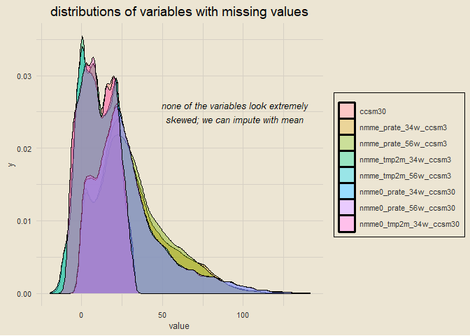

wids datathon 2023
================
chad allison
2023-01-31

------------------------------------------------------------------------

[kaggle
link](https://www.kaggle.com/competitions/widsdatathon2023/overview)

------------------------------------------------------------------------

### setup

``` r
tictoc::tic()
library(tidyverse)
library(tidymodels)
library(tvthemes)
library(janitor)
library(lubridate)
library(skimr)
library(patchwork)
options(scipen = 999)

theme_custom = theme_avatar() +
  theme(plot.title = element_text(hjust = 0.5),
        panel.grid.major = element_line(linewidth = 0.5, colour = "#D6D0C4"),
        panel.grid.minor = element_line(linewidth = 0.5, colour = "#D6D0C4"))
```

------------------------------------------------------------------------

### data import

``` r
train = read_csv("train_data.csv", col_types = cols()) |> clean_names()
test = read_csv("test_data.csv", col_types = cols()) |> clean_names()
sample_sol = read_csv("sample_solution.csv", col_types = cols()) |> clean_names()
paste0("training dimensions: ", nrow(train), " rows x ", ncol(train), " columns")
```

    ## [1] "training dimensions: 375734 rows x 246 columns"

``` r
paste0("testing dimensions: ", nrow(test), " rows x ", ncol(test), " columns")
```

    ## [1] "testing dimensions: 31354 rows x 245 columns"

------------------------------------------------------------------------

### finding variable types

``` r
paste0(ncol(select(train, where(is.numeric))), " numeric variables; ",
       ncol(select(train, where(is.character))), " character variables")
```

    ## [1] "244 numeric variables; 2 character variables"

------------------------------------------------------------------------

### reformatting `startdate` and `climateregions_climateregion` variables

``` r
train = train |>
  mutate(startdate = parse_date(startdate, format = "%m/%d/%y"),
         year = year(startdate),
         month = month(startdate),
         day = day(startdate),
         climateregions_climateregion = as.factor(climateregions_climateregion)) |>
  rename(climate_region = climateregions_climateregion)

train |>
  select(startdate, year, month, day, climate_region) |>
  skim()
```

|                                                  |                            |
|:-------------------------------------------------|:---------------------------|
| Name                                             | select(train, startdate, … |
| Number of rows                                   | 375734                     |
| Number of columns                                | 5                          |
| \_\_\_\_\_\_\_\_\_\_\_\_\_\_\_\_\_\_\_\_\_\_\_   |                            |
| Column type frequency:                           |                            |
| Date                                             | 1                          |
| factor                                           | 1                          |
| numeric                                          | 3                          |
| \_\_\_\_\_\_\_\_\_\_\_\_\_\_\_\_\_\_\_\_\_\_\_\_ |                            |
| Group variables                                  | None                       |

Data summary

**Variable type: Date**

| skim_variable | n_missing | complete_rate | min        | max        | median     | n_unique |
|:--------------|----------:|--------------:|:-----------|:-----------|:-----------|---------:|
| startdate     |         0 |             1 | 2014-09-01 | 2016-08-31 | 2015-09-01 |      731 |

**Variable type: factor**

| skim_variable  | n_missing | complete_rate | ordered | n_unique | top_counts                                      |
|:---------------|----------:|--------------:|:--------|---------:|:------------------------------------------------|
| climate_region |         0 |             1 | FALSE   |       15 | BSk: 139621, Dfb: 52632, Cfa: 51901, Csb: 40936 |

**Variable type: numeric**

| skim_variable | n_missing | complete_rate |    mean |   sd |   p0 |  p25 |  p50 |  p75 | p100 | hist  |
|:--------------|----------:|--------------:|--------:|-----:|-----:|-----:|-----:|-----:|-----:|:------|
| year          |         0 |             1 | 2015.17 | 0.69 | 2014 | 2015 | 2015 | 2016 | 2016 | ▃▁▇▁▆ |
| month         |         0 |             1 |    6.52 | 3.45 |    1 |    4 |    7 |   10 |   12 | ▇▅▅▅▇ |
| day           |         0 |             1 |   15.74 | 8.80 |    1 |    8 |   16 |   23 |   31 | ▇▇▇▇▆ |

------------------------------------------------------------------------

### counting climate regions

``` r
train |>
  count(climate_region) |>
  mutate(pct = paste0(round(n / sum(n) * 100, 1), "%")) |>
  ggplot(aes(reorder(climate_region, -n), n)) +
  geom_col(aes(fill = climate_region)) +
  geom_text(aes(label = pct), size = 3, vjust = -0.5) +
  theme_avatar() +
  labs(x = "climate region", y = "count", title = "counts of climate regions") +
  theme_custom +
  theme(legend.position = "none")
```

<!-- -->

------------------------------------------------------------------------

### finding missing values

``` r
data.frame(x = names(train), y = colSums(is.na(train))) |>
  filter(y > 0) |>
  ggplot(aes(reorder(x, y), y)) +
  geom_col(aes(fill = x)) +
  geom_text(aes(label = y), hjust = 1.25, size = 3) +
  labs(x = NULL, y = "number of NA values",
       title = "counts of missing values") +
  coord_flip() +
  theme_custom +
  theme(legend.position = "none")
```

<!-- -->

------------------------------------------------------------------------

### distribution of all missing values MAKE SURE TO REMOVE HEAD LINE

``` r
vars_with_NAs = data.frame(col = names(train), n = colSums(is.na(train))) |>
  filter(n > 0) |>
  pull(col)

train |>
  select(index, all_of(vars_with_NAs)) |>
  head(nrow(train) * 0.05) |> # REMOVE THIS LINE
  pivot_longer(cols = -index, names_to = "var_name", values_to = "value") |>
  mutate(is_na = is.na(value)) |>
  ggplot(aes(var_name, index)) +
  geom_tile(aes(fill = is_na), alpha = 0.75) +
  scale_fill_manual(values = c("#71926B", "#BA5757"), labels = c("complete", "missing")) +
  coord_flip() +
  theme_custom +
  labs(x = NULL, y = "index", fill = NULL,
       title = "distribution of missing values - could we have a temporal pattern?") +
  theme(plot.title = element_text(hjust = 0.5),
        legend.position = "right")
```

<!-- -->

------------------------------------------------------------------------

### checking distributions of missing variables before imputation

``` r
train |>
  select(all_of(vars_with_NAs)) |>
  pivot_longer(everything()) |>
  na.omit() |>
  ggplot(aes(value)) +
  geom_density(aes(fill = name), alpha = 0.4) +
  annotate("text", x = 95, y = 0.025, fontface = "italic", size = 3.5,
           label = "none of the variables look extremely\nskewed; we can impute with mean") +
  theme_custom +
  labs(title = "distributions of variables with missing values", fill = NULL) +
  theme(legend.position = "right")
```

<!-- -->

------------------------------------------------------------------------

### imputing missing data

``` r
train = train |>
  mutate(across(.cols = all_of(vars_with_NAs), ~ replace_na(., mean(., na.rm = T))))

paste0("number of NA values in training data: ", sum(is.na(train)))
```

    ## [1] "number of NA values in training data: 0"

------------------------------------------------------------------------

### visualization of target variable

``` r
fig1 = train |>
  ggplot(aes(startdate, contest_tmp2m_14d_tmp2m)) +
  geom_line(col = "#718F70", alpha = 0.5) +
  geom_hline(yintercept = mean(train$contest_tmp2m_14d_tmp2m), col = "black") +
  annotate("text", x = as_date("2015-01-01"), y = mean(train$contest_tmp2m_14d_tmp2m) - 2,
           label = "avg. temp. (\u00B0C)", size = 3.5) +
  labs(x = NULL, y = "target variable temp. (\u00B0C)",
       title = paste0("average temperature over time: ", min(train$startdate),
                      " to ", max(train$startdate))) +
  theme_custom +
  coord_cartesian(expand = F)

fig2 = train |>
  ggplot(aes(startdate, y = 1)) +
  geom_tile(aes(fill = contest_tmp2m_14d_tmp2m)) +
  scale_fill_stepsn(colors = c("#789DBB", "#D6D0C4", "#D38585")) +
  theme_custom +
  labs(x = NULL, y = NULL) +
  theme(legend.position = "none",
        axis.text = element_blank()) +
  coord_cartesian(expand = F)

fig1 / fig2
```

<!-- -->

------------------------------------------------------------------------

### outcome variable distribution

``` r
train |>
  ggplot(aes(contest_tmp2m_14d_tmp2m)) +
  geom_histogram(bins = 25, col = "black", fill = "#81A384") +
  theme_avatar() +
  labs(x = "outcome variable: contest_tmp2m_14d_tmp2m",
       y = "count", title = "distribution of outcome variable") +
  theme(plot.title = element_text(hjust = 0.5),
        panel.grid.major = element_line(linewidth = 0.5, colour = "#CFC7B7"),
        panel.grid.minor = element_line(linewidth = 0.5, colour = "#CFC7B7"))
```

<!-- -->

------------------------------------------------------------------------

### boxplots

``` r
train |>
  ggplot(aes(reorder(climate_region, contest_tmp2m_14d_tmp2m), contest_tmp2m_14d_tmp2m)) +
  geom_boxplot(aes(fill = climate_region)) +
  coord_flip() +
  theme_avatar() +
  labs(x = "climate region", y = "outcome variable: contest_tmp2m_14d_tmp2m",
       title = "boxplots of outcome variable by region") +
  theme(plot.title = element_text(hjust = 0.5),
        legend.position = "none",
        panel.grid.major = element_line(linewidth = 0.5, colour = "#CFC7B7"),
        panel.grid.minor = element_line(linewidth = 0.5, colour = "#CFC7B7"))
```

<!-- -->

------------------------------------------------------------------------

### script runtime

``` r
tictoc::toc()
```

    ## 28.1 sec elapsed
